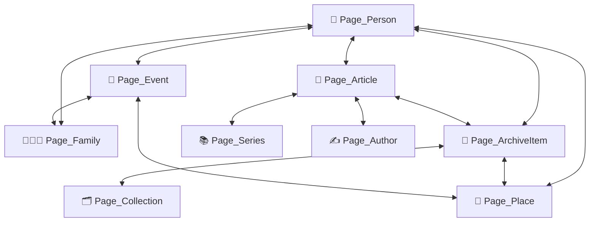

# CÂY GIA PHẢ — PUBLICATION MODEL v1
## Kiến Trúc Xuất Bản & Mô Hình Trang Toàn Diện (`giatoctrantrongthu`)
### STATUS: CANONICAL PUBLICATION ARCHITECTURE BASELINE (v1.0)
*Cầu nối: Architecture → Ontology → Publication → Page Model → Content Model → UX/UI*  
*Ngày cập nhật: 05/09/2026*  
*Workspace: `/Users/tuantq/Projects/Personal/giatoctrantrongthu`*  

---

> [!IMPORTANT]
> **ĐỊNH VỊ CỦA PUBLICATION MODEL v1:**
> - Tài liệu này đóng vai trò là **Đặc tả Mô hình Xuất bản (Publication Model Specification)** chính thức, chuyển hóa *Foundational Architecture* (`docs/architecture/ARCHITECTURE.md`) và *Ontology* (`docs/ontology/ONTOLOGY_AND_RULES.md`) thành cấu trúc hiển thị, phân loại trang (*Page Types*) và mô hình liên kết nội dung (*Content & Cross-linking Model*).
> - **Ranh giới thực thi:** Đây là tài liệu kiến trúc xuất bản lý thuyết — **KHÔNG triển khai mã nguồn, không viết component UI, không can thiệp CSS/JS hay production code.**

---

## 1. MỤC ĐÍCH & ĐỊNH VỊ XUẤT BẢN (PUBLICATION PURPOSE & POSITIONING)

### 1.1. Bản chất của Publication
Publication `giatoctrantrongthu.vercel.app` là một **Hệ Thống Xuất Bản Di Sản & Ký Ức Gia Tộc Thống Nhất (Unified Family Heritage & Memory Publication)**, phục vụ mục tiêu cốt lõi:
> **“Xây dựng hạ tầng để một dòng họ có thể bắt đầu nhớ chính mình một cách có hệ thống.”**

### 1.2. Phân định giữa Database và Publication
- **Database / Knowledge System:** Là lớp cấu trúc dữ liệu bên dưới (lưu trữ entities, GEDCOM facts, quan hệ đồ thị, mã nguồn, timestamps, provenance và thang xác tín).
- **Publication:** Là phương thức con người tiếp cận, đọc, tương tác, khám phá và cảm nhận ý nghĩa của dòng họ. Publication không phơi bày toàn bộ database thô mà thực hiện **giám tuyển biên tập (Editorial Curation)**, tổ chức bố cục trực quan và dẫn dắt luồng đọc có chủ đích.

---

## 2. BA VÙNG XUẤT BẢN CỐT LÕI (3 PUBLICATION TERRITORIES)

Hệ thống xuất bản được tổ chức thành một cấu trúc duy nhất gồm **3 Vùng Xuất Bản (Publication Territories)** liên kết chặt chẽ trên cùng một nền tảng tri thức:

```
┌─────────────────────────────────────────────────────────────────────────────────────────┐
│                           DÒNG HỌ TRẦN TRỌNG THU (PUBLICATION)                          │
├──────────────────────────┬────────────────────────────┬─────────────────────────────────┤
│ 1. GIA PHẢ               │ 2. MẠCH                    │ 3. TƯ LIỆU                      │
│ (STRUCTURED HERITAGE)    │ (EDITORIAL & VOICE)        │ (ARCHIVAL RECORDS)              │
├──────────────────────────┼────────────────────────────┼─────────────────────────────────┤
│ • Dòng họ là ai          │ • Ký ức, tự sự, chiêm ngẫm │ • Những gì thực sự còn lại     │
│ • Thế thứ, phả hệ F0–F4  │ • Bút ký, tiểu luận nếp nhà│ • Di ảnh, chân dung tiền nhân   │
│ • Danh bạ người & nhà    │ • Thư gửi thế hệ kế thừa   │ • Sổ rửa tội, giấy tờ hộ tịch   │
│ • Quan hệ, chi nhánh     │ • Tuyển tập (Series)       │ • Trích lục Hán Nôm, thư từ     │
│ • Địa danh & thời gian   │ • Tiếng nói đa tác giả     │ • Ghi âm, video, kỷ vật         │
└──────────────────────────┴────────────────────────────┴─────────────────────────────────┘
```

### Ranh giới nghiêm ngặt giữa 3 Territories:
1. **Không phải 3 website hay 3 database độc lập:** Cả 3 vùng cùng khai thác chung một mạng lưới thực thể (*Entity Graph*), cùng chia sẻ các năng lực dùng chung (*Universal Search, Temporal Engine*).
2. **GIA PHẢ:** Là trục **xác lập cấu trúc khách quan** (Ai thuộc về ai, thế hệ nào, nhánh nào, sống ở đâu).
3. **MẠCH:** Là trục **thấu cảm và diễn giải** (Nếp nhà được cảm nhận thế nào, bài học đời sống được trao truyền ra sao). MẠCH được phép có tiếng nói chủ quan nhưng phải phân biệt rõ với Fact.
4. **TƯ LIỆU:** Là trục **bằng chứng chứng thực độc lập** (Những mảnh vật chứng cụ thể). Tư liệu không phải là "file đính kèm" của bài viết; tư liệu có đời sống và giá trị bảo tồn độc lập.

---

## 3. PHÂN ĐỊNH 6 KHÁI NIỆM CỐT LÕI (CONCEPTUAL DISTINCTION)

Để tránh nhập nhằng giữa dữ liệu, chức năng và giao diện hiển thị:

```
┌────────────────────────────────────────────────────────────────────────────────────────┐
│ 1. ENTITY (Thực tại)                                                                   │
│    • Đối tượng cụ thể tồn tại trong lịch sử hoặc đời sống: Person, Family, Place...   │
├────────────────────────────────────────────────────────────────────────────────────────┤
│ 2. KNOWLEDGE (Tri thức)                                                                │
│    • Thông tin, sự kiện, mối liên kết, độ xác tín được ghi nhận về Entity.            │
├────────────────────────────────────────────────────────────────────────────────────────┤
│ 3. EXPRESSION (Diễn đạt)                                                               │
│    • Hình thức câu chuyện, bài luận, lá thư kể lại tri thức đó dưới góc nhìn tự sự.  │
├────────────────────────────────────────────────────────────────────────────────────────┤
│ 4. RECORD / ARCHIVE (Văn khố & Vật chứng)                                              │
│    • Tệp tư liệu cụ thể: tệp scan, ảnh cổ, văn bản gốc, file ghi âm.                  │
├────────────────────────────────────────────────────────────────────────────────────────┤
│ 5. CAPABILITY (Năng lực chức năng)                                                     │
│    • Công cụ tính toán / tra cứu xuyên suốt: Universal Search, Lịch 4 Feeds, Kinship.   │
├────────────────────────────────────────────────────────────────────────────────────────┤
│ 6. PUBLICATION PAGE (Trang xuất bản)                                                   │
│    • Đơn vị giao diện hoàn chỉnh được biên tập để người dùng đọc và tương tác.         │
└────────────────────────────────────────────────────────────────────────────────────────┘
```

---

## 4. HỆ THỐNG 15 LOẠI TRANG XUẤT BẢN CHÍNH (15 CORE PAGE TYPES)

Mô hình xuất bản quy định 15 Page Types chuẩn mực với công năng và cấu trúc rõ ràng:

```
                             HỆ THỐNG 15 PAGE TYPES
┌───────────────────────────────────────────────────────────────────────────────────────┐
│ 0. KHÔNG GIAN CỔNG & BỐI CẢNH                                                         │
│    [01] Page_Home              : Cổng định vị di sản & dẫn nhập 3 trục                │
│    [02] Page_SectionLanding    : Cửa ngõ từng vùng (Landing Gia Phả / Mạch / Tư Liệu) │
│    [14] Page_AboutFamily       : Bối cảnh, lịch sử, nơi chốn và những điều còn lại    │
│    [15] Page_AboutProject      : Vì sao có Cây Gia Phả, phương pháp & stewardship     │
├───────────────────────────────────────────────────────────────────────────────────────┤
│ 1. VÙNG GIA PHẢ (STRUCTURED HERITAGE)                                                 │
│    [03] Page_Person            : Hồ sơ nhân vật (Căn cước, đời người, liên kết)       │
│    [04] Page_Family            : Hồ sơ gia đình hạt nhân (Cặp vợ chồng, con cái)      │
│    [05] Page_Branch            : Hồ sơ chi / nhánh dòng họ                            │
│    [06] Page_Generation        : Góc nhìn phân tầng thế hệ (F0–F4)                    │
│    [07] Page_Place             : Nơi chốn lịch sử (Thọ Vực, Bình Châu, Bình Triệu...) │
│    [08] Page_Event             : Mốc sự kiện lịch sử, lễ giỗ, biến cố chuyển dời      │
├───────────────────────────────────────────────────────────────────────────────────────┤
│ 2. VÙNG MẠCH (EDITORIAL & NARRATIVES)                                                 │
│    [09] Page_Article           : Bài viết, bút ký, câu chuyện, mẩu ký ức              │
│    [10] Page_Series            : Tuyển tập chuyên đề (Featured: "Thư gửi Clara")      │
│    [11] Page_Author            : Hồ sơ tác giả chấp bút / Nhân chứng lịch sử          │
├───────────────────────────────────────────────────────────────────────────────────────┤
│ 3. VÙNG TƯ LIỆU (ARCHIVAL RECORDS)                                                    │
│    [12] Page_ArchiveItem       : Hồ sơ hiện vật / tư liệu đơn lẻ (kèm nguồn & cờ xác tín)│
│    [13] Page_Collection        : Bộ sưu tập tư liệu theo chủ đề hoặc thời kỳ          │
└───────────────────────────────────────────────────────────────────────────────────────┘
```

### Chi tiết Đặc tả Từng Page Type:

#### 1. `Page_Home` (Trang Chủ)
- **Vai trò:** Cổng dẫn nhập chính thức, thiết lập định vị tinh thần: *"Nơi những gì còn nhớ được ở lại, được kết nối và có thể được truyền lại."*
- **Cấu phần cốt lõi:**
  - Hero lời mở đầu ấn phẩm.
  - Ba thẻ cửa ngõ dẫn vào 3 Trục nội dung (Gia Phả, Mạch, Tư Liệu).
  - Khối tóm lược những gì đang được ghi nhận (Số lượng người, gia đình, bài viết, tư liệu).
  - Bài viết tự sự mới nhất từ MẠCH.
  - Dẫn hướng sang *Về Dòng Họ* và *Về Dự Án*.

#### 2. `Page_SectionLanding` (Trang Cửa Ngõ Phân Hệ)
- **Vai trò:** Trang đích định hướng riêng cho từng Territory (`Gia Phả Landing`, `Mạch Landing`, `Tư Liệu Landing`).
- **Cấu phần:** Giới thiệu tôn chỉ của vùng, các công cụ lọc chuyên biệt, danh mục nổi bật và các góc nhìn (View Modes).

#### 3. `Page_Person` (Hồ Sơ Nhân Vật)
- **Vai trò:** Điểm neo trung tâm của một cá nhân trong dòng họ.
- **Cấu phần:**
  - *Định danh:* Thánh danh, Họ tên, Thế hệ (F0–F4), Chi nhánh, Tình trạng (Còn sống / Đã tạ thế).
  - *Dữ kiện tiểu sử:* Ngày sinh, ngày mất, ngày bổn mạng, nơi sinh, nghề nghiệp.
  - *Mạng lưới quan hệ:* Cha mẹ, Vợ/Chồng, Con cái, Anh chị em.
  - *Vị trí trên phả đồ:* Nút bấm chuyển nhanh sang Family Graph (Focus Mode).
  - *Mục liên kết đa chiều:* Các bài viết MẠCH nhắc tới nhân vật, các tư liệu / ảnh có mặt nhân vật, mức độ xác tín của hồ sơ (`CONFIRMED`, `ORAL_TRADITION`...).

#### 4. `Page_Family` (Hồ Sơ Gia Đình Hạt Nhân)
- **Vai trò:** Thể hiện đơn vị cấu trúc gia đình nhỏ trong dòng tộc.
- **Cấu phần:** Thông tin cặp hôn phối, ngày cưới (nếu có), danh sách con cái trực hệ, chi nhánh trực thuộc, các tư liệu liên quan đến gia đình.

#### 5. `Page_Branch` (Hồ Sơ Chi / Nhánh)
- **Vai trò:** Thể hiện sự phân nhánh từ các Cụ đời F1 (ví dụ: *Nhánh Cụ Thư, Nhánh Chú Thả...*).
- **Cấu phần:** Trưởng nhánh, lịch sử phân nhánh, địa bàn cư trú chính, danh sách các gia đình thuộc nhánh.

#### 6. `Page_Generation` (Góc Nhìn Phân Tầng Thế Hệ)
- **Vai trò:** Cung cấp bức tranh toàn cảnh theo từng tầng thế hệ F0, F1, F2, F3, F4.
- **Cấu phần:** Bối cảnh thời đại của thế hệ, số lượng thành viên, danh sách các gia đình cùng thế hệ.

#### 7. `Page_Place` (Hồ Sơ Nơi Chốn & Địa Danh)
- **Vai trò:** Lưu giữ các địa danh gắn liền với lịch sử dòng họ.
- **Cấu phần:** Tên địa danh (*Giáo xứ Thọ Vực — Bùi Chu, Bình Châu, Fatima Bình Triệu, Sài Gòn*), tọa độ/bản đồ, ý nghĩa lịch sử, danh sách nhân vật và sự kiện gắn với địa danh.

#### 8. `Page_Event` (Hồ Sơ Sự Kiện & Mốc Thời Gian)
- **Vai trò:** Trình bày một mốc biến cố (chuyến tàu di cư 1954, ngày khánh thành mộ tổ, ngày lễ giỗ chung).
- **Cấu phần:** Thời gian (Dương lịch & Âm lịch), địa điểm, nhân vật liên quan, tư liệu chứng thực, mô tả bối cảnh.

#### 9. `Page_Article` (Trang Đọc Bài Viết / Tự Sự)
- **Vai trò:** Không gian đọc bài viết sâu, bút ký, tiểu luận trong MẠCH.
- **Cấu phần:** Tiêu đề, Lead deck, Tác giả & ngày viết, Thể loại (`BÚT KÝ`, `GÓC NHÌN`, `KÝ ỨC`), Nội dung chữ định dạng typographic cao cấp, Hình ảnh tư liệu xen kẽ rich captions, Trích dẫn (`Pull quote`), Thẻ nhân vật liên quan, Ghi chú / Footnotes.

#### 10. `Page_Series` (Trang Tuyển Tập / Series)
- **Vai trò:** Tập hợp các bài viết theo một mạch chủ đề nhất quán (Tiêu biểu: *"Thư gửi Clara"*).
- **Cấu phần:** Bìa tuyển tập, Lời giới thiệu series, Tác giả phụ trách, Mục lục các bài theo thứ tự tuyến tính, Điều hướng bài trước/sau.

#### 11. `Page_Author` (Hồ Sơ Tác Giả / Nhân Chứng)
- **Vai trò:** Tôn vinh người chấp bút hoặc nhân chứng cung cấp lời kể.
- **Cấu phần:** Tên, Bút danh, Vai vế trong dòng họ (ví dụ: *F2 - Người giữ mạch*), Tiểu sử tóm tắt, Danh sách các bài viết / câu chuyện đã đóng góp.

#### 12. `Page_ArchiveItem` (Hồ Sơ Tư Liệu / Hiện Vật Đơn Lẻ)
- **Vai trò:** Trưng bày và bảo tồn một chứng từ lịch sử độc lập.
- **Cấu phần:** Trình xem ảnh/file scan độ phân giải cao, Loại tư liệu (*Ảnh di sản, Trích lục Hán Nôm, Sổ rửa tội, Thư tay, Audio*), Ngày tạo / Niên đại, Người cung cấp (*Provenance*), Nhãn mức độ xác tín, Danh sách nhân vật / địa danh liên quan.

#### 13. `Page_Collection` (Bộ Sưu Tập Tư Liệu)
- **Vai trò:** Gom nhóm các tư liệu theo một sự kiện hoặc chủ đề (ví dụ: *Bộ sưu tập ảnh Mộ tổ, Hồ sơ hộ tịch thời di cư*).
- **Cấu phần:** Mô tả bộ sưu tập, Lưới các tư liệu thành phần, Lời bình khảo cứu.

#### 14. `Page_AboutFamily` (Về Dòng Họ)
- **Vai trò:** Cung cấp bối cảnh lịch sử, nguồn gốc nguyên thủy, hành trình di cư và những giá trị nếp nhà truyền thống của Dòng họ Trần Trọng Thu.

#### 15. `Page_AboutProject` (Về Dự Án & Quản Trị)
- **Vai trò:** Minh bạch hóa lý do dự án ra đời, phương pháp luận khảo cứu, nguyên tắc ghi chép, thang 7 mức độ xác tín và cơ chế để các thế hệ con cháu tiếp quản, hiệu đính.

---

## 5. MA TRẬN ÁNH XẠ: ONTOLOGY ⟷ PAGE TYPES (ONTOLOGY-PAGE MAPPING)

Bảng sau xác định cách các đối tượng trong Bản thể luận (`Ontology`) được hiện thực hóa thành các Trang xuất bản (`Page Types`):

| Tầng Bản Thể Luận (Ontology Layer) | Đối Tượng Tri Thức (Knowledge Object) | Page Type Tương Ứng (Publication Page Type) | Vai Trò Xuất Bản (Publication Role) |
| :--- | :--- | :--- | :--- |
| **ENTITY** | `Person` | `Page_Person` (`#/person/:id`) | Trang tiểu sử & điểm tựa thực thể cá nhân |
| **ENTITY** | `Family` | `Page_Family` (`#/family/:id`) | Trang gia đình hạt nhân & quan hệ hôn phối |
| **ENTITY** | `Branch` | `Page_Branch` (`#/branch/:id`) | Trang phân nhánh chi tộc |
| **ENTITY** | `Generation` | `Page_Generation` (`#/generation/:gen`) | Trang góc nhìn phân tầng thế hệ F0–F4 |
| **ENTITY** | `Place` | `Page_Place` (`#/place/:id`) | Trang địa danh & không gian lịch sử |
| **ENTITY** | `Event` | `Page_Event` (`#/event/:id`) | Trang mốc sự kiện & biến cố đời sống |
| **RECORD / ARCHIVE** | `Document` / `Media` | `Page_ArchiveItem` (`#/archive/:id`)| Trang bảo tồn tư liệu & chứng từ độc lập |
| **RECORD / ARCHIVE** | `Collection` | `Page_Collection` (`#/collection/:id`)| Trang bộ sưu tập tư liệu chuyên đề |
| **EXPRESSION** | `Story` / `Essay` / `Letter` | `Page_Article` (`#/mach/bai-viet/:slug`)| Trang đọc bài viết tự sự / chiêm nghiệm |
| **EXPRESSION** | `Series` | `Page_Series` (`#/mach/series/:slug`) | Trang tuyển tập chuyên đề nhiều kỳ |
| **EXPRESSION** | `Author` / `Witness` | `Page_Author` (`#/mach/author/:id`) | Trang hồ sơ tác giả / nhân chứng |
| **STEWARDSHIP** | `Family Heritage Context` | `Page_AboutFamily` (`#/about-family`) | Trang lịch sử & cội nguồn dòng họ |
| **STEWARDSHIP** | `Methodology & Governance` | `Page_AboutProject` (`#/about-project`)| Trang phương pháp, xác tín & truyền thừa |
| **CAPABILITY** | `Universal Search` | Modal / Drawer Inset (Toàn cục) | Khả năng tra cứu liên hợp đa miền |
| **CAPABILITY** | `Temporal Engine (4 Feeds)`| `View_Calendar` (Chiếu trong Gia Phả)| Bản chiếu thời gian của các mốc sự kiện |

---

## 6. MÔ HÌNH LIÊN KẾT NGỮ CẢNH ĐA CHIỀU (CROSS-LINKING MODEL)

Trái tim của Publication Model v1 là mạng lưới liên kết ngữ cảnh đa chiều. Không một trang nào là một "hòn đảo cô lập":



### Nguyên tắc liên kết ngữ cảnh:
- **Từ Hồ sơ Nhân vật (`Page_Person`):** Độc giả có thể nhảy ngay tới các bài viết MẠCH kể về họ, xem các ảnh scan hộ tịch / sổ rửa tội trong TƯ LIỆU, bấm chuyển sang Phả đồ trực hệ, hoặc xem các mốc ngày giỗ.
- **Từ Bài viết MẠCH (`Page_Article`):** Mọi tên người trong bài đều có thể gắn thẻ (*entity tag*) để độc giả mở nhanh Profile nhân vật trong Gia Phả; các dữ kiện lịch sử có liên kết dẫn chứng sang chứng từ gốc trong TƯ LIỆU.
- **Từ Tư liệu (`Page_ArchiveItem`):** Hiển thị danh sách các nhân vật xuất hiện trong tư liệu, địa danh nơi chụp/lưu trữ và các bài viết MẠCH có sử dụng tư liệu này làm dẫn chứng.

---

## 7. CÁC CHẾ ĐỘ ĐỌC VÀ TIẾP CẬN TRI THỨC (READING MODES)

Publication Model cho phép người dùng tiếp cận cùng một đối tượng tri thức (*Knowledge Object*) qua **4 Chế độ Đọc chuyên biệt**:

```
                                  KNOWLEDGE OBJECT
                              (Ví dụ: Cụ Giuse Trần Trọng Thu)
                                           │
         ┌───────────────────┬─────────────┴─────┬───────────────────┐
         ▼                   ▼                   ▼                   ▼
   1. LINEAGE MODE     2. NARRATIVE MODE   3. EVIDENCE MODE    4. TEMPORAL MODE
    (Phả hệ học)          (Tự sự Mạch)       (Văn khố chứng từ)    (Nhịp thời gian)
         │                   │                   │                   │
  • Vị trí Cố Thu F0  • Thư gửi Clara #01 • Bản scan Hán Nôm  • Lễ Giỗ 10/10 Âm
  • 6 người con F1    • Bút ký nếp nhà    • Sổ Rửa tội Bùi Chu • Bổn mạng Giuse 19/3
  • Cây phả đồ tương tác • Chân dung ký ức • Cờ xác tín CONFIRMED • Đồng bộ Lịch ICS
```

1. **Lineage Mode (Chế độ Phả Hệ):** Tiếp cận qua cấu trúc phả đồ, thứ bậc huyết thống, phân tầng thế hệ.
2. **Narrative Mode (Chế độ Tự Sự):** Tiếp cận qua các trang văn bút ký, hồi ức gia đình, dòng chảy chiêm nghiệm trong MẠCH.
3. **Evidence Mode (Chế độ Chứng Cứ):** Tiếp cận qua văn kiện gốc, chữ ký, con dấu, bản scan di sản trong TƯ LIỆU.
4. **Temporal Mode (Chế độ Thời Gian):** Tiếp cận qua nhịp điệu sinh hoạt thường niên, ngày giỗ, ngày lễ quan thầy bổn mạng trên Lịch.

---

## 8. CHU TRÌNH VÒNG ĐỜI NỘI DUNG (CONTENT LIFECYCLE)

Toàn bộ nội dung xuất bản vận hành theo chu trình 4 bước:

$$	ext{GIỮ LẠI (Preserve)} \longrightarrow 	ext{KẾT NỐI (Connect)} \longrightarrow 	ext{DIỄN GIẢI (Interpret)} \longrightarrow 	ext{TRUYỀN LẠI (Transmit)}$$

1. **GIỮ LẠI:** Thu thập những gì thực sự còn lại (tên người, di ảnh, giấy tờ, ghi âm lời kể), ghi nhận trung thực và gán cờ xác minh.
2. **KẾT NỐI:** Thiết lập mối liên kết ngữ nghĩa giữa con người, gia đình, nơi chốn, thời gian và tư liệu.
3. **DIỄN GIẢI:** Suy ngẫm, viết bút ký trong MẠCH để nhận diện nếp nhà, tinh thần gia phong và bài học đời sống.
4. **TRUYỀN LẠI:** Xuất bản và chuyển giao cho các thế hệ con cháu kế thừa, tiếp tục cập nhật và duy trì mạch sống dòng họ.

---

## 9. BẢNG PHÂN LOẠI: CONFIRMED ARCHITECTURE VS. WORKING HYPOTHESES

| Thành Phần Kiến Trúc | Trạng Thái Phân Loại | Diễn Giải & Ghi Chú |
| :--- | :--- | :--- |
| **Ba Vùng Xuất Bản (Gia Phả, Mạch, Tư Liệu)** | `CONFIRMED ARCHITECTURE` | Đã khóa — Là 3 trục nội dung thống nhất của publication. |
| **Nguyên tắc "Giữ lại trước khi diễn giải"** | `CONFIRMED ARCHITECTURE` | Đã khóa — Kỷ luật ghi chép tối thượng của dự án. |
| **Hệ thống 15 Page Types** | `CONFIRMED ARCHITECTURE` | Đã khóa — Khung sườn phân loại trang xuất bản. |
| **Mô hình Cross-linking đa chiều** | `CONFIRMED ARCHITECTURE` | Đã khóa — Quy chuẩn liên kết ngữ cảnh giữa các trang. |
| **Định vị Lịch & Search là Capabilities** | `CONFIRMED ARCHITECTURE` | Đã khóa — Không nâng cấp thành sub-brand độc lập. |
| **Slogan / Brand Statement chính thức** | `WORKING HYPOTHESIS` | Tạm dùng: *"Nơi những gì còn nhớ được ở lại..."* |
| **Copy Lời Mở Đầu Trang Chủ** | `WORKING HYPOTHESIS` | Đang ở dạng bản thảo biên tập định hướng tinh thần. |
| **Chi tiết Thuộc tính Schema cho Artifact** | `WORKING HYPOTHESIS` | Cần tinh chỉnh trong Data Contract tiếp theo. |

---

## 10. DANH MỤC CÁC CÂU HỎI MỞ (OPEN QUESTIONS)

1. **Open Question 01 (Public vs Internal Privacy Boundary):**
   - Tiêu chí cụ thể nào để tự động ẩn các dữ kiện cá nhân (số điện thoại, địa chỉ nhà riêng, ngày sinh chính xác) của thế hệ F3, F4 còn sống trên các Page Types công khai?
2. **Open Question 02 (Evidence Tagging UI Visual Language):**
   - Biểu tượng và màu sắc nào thể hiện 7 mức độ xác tín (`CONFIRMED`, `ORAL_TRADITION`...) trên `Page_Person` và `Page_ArchiveItem` một cách tôn nghiêm, khách quan mà không làm rối mắt người đọc phổ thông?
3. **Open Question 03 (Editorial Contribution Workflow):**
   - Quy trình tiếp nhận một bài viết mới từ một người con trong dòng họ trước khi đưa lên `Page_Article` trong MẠCH?
4. **Open Question 04 (Physical Artifact Preservation Linkage):**
   - Cách thức đánh số mã lưu trữ thực tế (*Physical Archive Box/ID*) cho các kỷ vật đang được cất giữ ngoài đời thực để đối chiếu với `Page_ArchiveItem` trên web?
