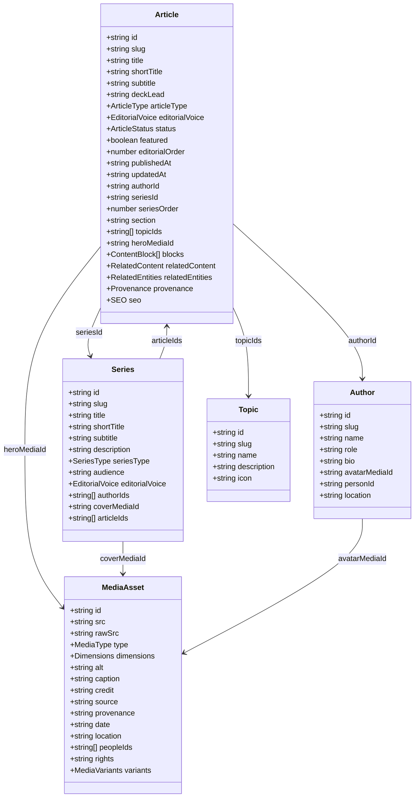

# ĐẶC TẢ KIẾN TRÚC XUẤT BẢN: MACH_FOUNDATION_02
**Content & Media Engine cho Tạp chí MẠCH trong Hệ sinh thái Dòng họ Trần Trọng Thu**

- **Tài liệu**: `docs/ux/MACH_FOUNDATION_02_CONTENT_MEDIA_ENGINE.md`
- **Mã nhiệm vụ**: `MACH_FOUNDATION_02`
- **Phân loại**: Architectural Specification & Contract (Phase 1 — No Code Deployment)
- **Tài liệu nền tảng**: `docs/ux/MACH_FOUNDATION_01_PUBLICATION_ENGINE_SPEC.md`
- **Mục tiêu cốt lõi**: Chuyển đổi mô hình xuất bản từ **"Markdown thô $\rightarrow$ `contentMarkdown` $\rightarrow$ 1 Template cứng"** sang **"Source Content $\rightarrow$ Normalized Model $\rightarrow$ Content Blocks + Media Registry $\rightarrow$ Composition Engine $\rightarrow$ Presentation"**.
- **Phạm vi tác động**: Không gian xuất bản MẠCH (`#/mach`, `#/mach/bai-viet/*`, `#/mach/series/*`, `#/mach/tac-gia/*`).
- **Nguyên tắc bảo toàn**: Độc lập tuyệt đối với Cây Gia Phả, GEDCOM, Lịch Gia Tộc, ICS và tác vụ song song của Series "Thư gửi Clara".

---

## 1. KHẢO SÁT & AUDIT HIỆN TRẠNG KỸ THUẬT (CURRENT IMPLEMENTATION AUDIT)

Khảo sát thực tế mã nguồn và dữ liệu đang vận hành tại repo `giatoctrantrongthu`:

```
┌─────────────────────────────────────────────────────────────────────────────────────────────────┐
│                                 MA TRẬN ĐỐI SOÁT HIỆN TRẠNG MẠCH                                │
├──────────────────────────┬──────────────┬───────────────────────────────────────────────────────┤
│ Thành phần               │ Trạng thái   │ Hiện trạng kỹ thuật thực tế                           │
├──────────────────────────┼──────────────┼───────────────────────────────────────────────────────┤
│ `data/mach.json`         │ WHAT EXISTS  │ JSON v2.1 chứa `authors`, `series`, `topics`,         │
│                          │              │ `stories`. Mỗi story lưu `contentMarkdown` thô.       │
│                          │              │ Media chỉ là chuỗi string `coverImage` hoặc URL rải   │
│                          │              │ rác trong Markdown, chưa có Media Entity độc lập.     │
├──────────────────────────┼──────────────┼───────────────────────────────────────────────────────┤
│ `scripts/build_mach.py`  │ WHAT EXISTS  │ Đọc Markdown từ Obsidian, regex excerpt, copy nguyên  │
│                          │              │ xi `raw_content` vào `contentMarkdown`. Chưa parse ra │
│                          │              │ Blocks, chưa bóc tách Spreads, Captions hay Footnotes │
├──────────────────────────┼──────────────┼───────────────────────────────────────────────────────┤
│ `content/mach/`          │ WHAT EXISTS  │ Thư mục chứa các file .md mirror từ Obsidian:         │
│                          │              │ `issue-01/` (13 files) và `thu-gui-clara/` (7 files). │
├──────────────────────────┼──────────────┼───────────────────────────────────────────────────────┤
│ `assets/images/mach/`    │ PARTIAL      │ Mới có thư mục `thu-gui-clara/` (ảnh 001.png - 007.png)│
│                          │              │ Ảnh tư liệu gốc của `ISSUE_01` vẫn nằm ngoài repo ở   │
│                          │              │ `/Users/tuantq/Projects/Personal/MACH/assets/`.       │
├──────────────────────────┼──────────────┼───────────────────────────────────────────────────────┤
│ `src/js/app.js`          │ TIGHTLY      │ Hàm `openStoryDetail(slug)` parse Markdown thô tại    │
│ (`openStoryDetail`)      │ COUPLED      │ runtime client bằng regex phân đoạn `\n\n`. Có logic  │
│                          │              │ rẽ nhánh cứng `isClara = story.seriesSlug === ...`    │
│                          │              │ để render tiêu đề và nhãn điều hướng!                 │
├──────────────────────────┼──────────────┼───────────────────────────────────────────────────────┤
│ `src/css/main.css`       │ SOLID FOUND. │ Đã thiết lập hoàn chỉnh Font Option C (`Be Vietnam    │
│                          │              │ Pro` cho UI + `Source Serif 4` cho Reading Body).     │
│                          │              │ Đã có styles cho `blockquote`, `figure`, `figcaption`.│
│                          │              │ Chưa có styling cho Block Gallery, Callout, Lead Deck.│
├──────────────────────────┼──────────────┼───────────────────────────────────────────────────────┤
│ `index.html`             │ MINIMAL DOM  │ View `#view_story` dùng 1 container `<div id=         │
│                          │              │ "storyContentBody">` duy nhất để hứng toàn bộ HTML.   │
└──────────────────────────┴──────────────┴───────────────────────────────────────────────────────┘
```

### 1.1. Bóc tách 10 câu hỏi hiện trạng:

1. **Model Article hiện tại**: Đối tượng phẳng trong mảng `machData.stories[]` gồm `slug`, `title`, `shortTitle`, `subtitle`, `section`, `seriesSlug`, `seriesOrder`, `authorId`, `articleType`, `editorialVoice`, `date`, `created`, `updated`, `excerpt`, `coverImage`, `topics`, `mentions`, `contentMarkdown`.
2. **Model Series hiện tại**: Đối tượng trong dictionary `machData.series{}` gồm `slug`, `title`, `shortTitle`, `subtitle`, `description`, `authorId`, `seriesType`, `audience`, `editorialVoice`, `coverImage`, `stories` (mảng slugs).
3. **Model Author hiện tại**: Đối tượng trong `machData.authors{}` gồm `id`, `name`, `role`, `bio`, `avatar`.
4. **Model Topic hiện tại**: Đối tượng trong `machData.topics{}` gồm `slug`, `title`, `count`.
5. **Media hiện tại**: Chưa tồn tại model Media. Ảnh đang là chuỗi đường dẫn string đơn lẻ (`coverImage: "assets/images/..."`) hoặc các thẻ markdown inline `` chôn sâu trong `contentMarkdown`. Không có metadata về kích thước, bản quyền, xuất xứ (provenance), ngày chụp hay nhân vật xuất hiện.
6. **Cách Markdown đang parse**: Runtime Regex trong trình duyệt (`app.js:1546-1565`):
   - Xóa YAML Frontmatter: `replace(/^---[\s\S]*?---\s*/, '')`
   - Xóa tiêu đề H1 đầu tiên: `replace(/^#\s+[^\n]+\n+/, '')`
   - Biến `` thành `<figure><figcaption>`
   - Split chuỗi bằng `split(/\n\s*\n/)` rồi duyệt từng đoạn để bọc thẻ `<p>`, `<h2>`, `<blockquote>`.
   - **Hạn chế nghiêm trọng**: Các ghi chú biên tập `[SPREAD 01]`, `[IMAGE]`, `[CAPTION]`, các block footnote `[^1]`, và block Obsidian links `[[...]]` bị parse thành các đoạn text lỗi màu đỏ hoặc text rác ngay trong giao diện người đọc.
7. **Cách Article Detail đang render**: Đổ toàn bộ chuỗi HTML sau regex vào `document.getElementById("storyContentBody").innerHTML`. Bị hard-code điều kiện:
   ```javascript
   const isClara = story.seriesSlug === "thu-gui-clara";
   if (isClara) {
       tagOrder.innerText = `THƯ GỬI CLARA • LÁ THƯ SỐ ${String(story.seriesOrder).padStart(2, '0')}`;
   } else { ... }
   ```
8. **Phần có thể tái sử dụng ngay**:
   - Hệ thống định tuyến Route Hash (`#/mach/bai-viet/:slug`, `#/mach/series/:slug`, `#/mach/tac-gia/:id`).
   - Breadcrumb navigation, Sub-navigation tabs (`Tất cả`, `Series`, `Tác giả`).
   - Author Card component ở chân bài viết.
   - Design System token và Typography Hierarchy (`Source Serif 4` cho bài viết, measure $\le 720\text{px}$).
9. **Phần bắt buộc phải thay đổi**:
   - Chuyển `contentMarkdown` thô thành mảng `blocks: ContentBlock[]`.
   - Tách Media thành kho thực thể độc lập `media: Record<string, MediaAsset>`.
   - Bỏ toàn bộ logic hard-code theo series trong renderer client (`isClara`, v.v.).
   - Đưa quá trình parse Markdown từ **Client Runtime** về **Build-Time Transformer** trong Python script.
10. **Phần tuyệt đối không được phá**:
    - GEDCOM Parser (`loadGedcomFile`, `individuals`, `families`).
    - Cây Gia Phả tương tác, Modal Person Profile, Family Tree Graph.
    - Hệ thống Lịch Dòng Họ (`#/calendar`), ICS generator, Google Calendar sync.
    - Cấu trúc URL routes hiện tại (để không làm gãy bookmark và liên kết ngoài).

---

## 2. NORMALIZED CONTENT MODEL (MÔ HÌNH NỘI DUNG CHUẨN TẮC)

Mô hình chuẩn tắc phân tách rành mạch giữa **thực thể định danh (Entities)**, **cấu trúc biên tập (Editorial Structure)** và **tài nguyên truyền thông (Media Assets)**.



### 2.1. TypeScript Schema Definitions:

```typescript
// --- ENUMS & TYPES ---
export type ArticleType = 
  | 'essay'              // Bút ký, tự sự chiêm nghiệm
  | 'feature'            // Bài chuyên đề, phóng sự dài kỳ
  | 'research'           // Khảo cứu, phân tích lịch sử/nếp nhà
  | 'letter'             // Thư từ, tâm tình thế hệ
  | 'interview'          // Đối thoại, phỏng vấn nhân vật
  | 'memorial'           // Tưởng niệm, chân dung người xưa
  | 'chronicle'          // Biên niên sử, ký sự dòng họ
  | 'explainer'          // Hướng dẫn nghi lễ, giải thích phong tục
  | 'commentary'         // Bình luận văn hóa đương đại
  | 'archive_record';    // Bản ghi giải mã văn tự, gia bảo

export type EditorialVoice = 
  | 'FACT'               // Tư liệu thuần túy, chứng cứ lịch sử
  | 'ANALYSIS'           // Nghiên cứu học thuật, phân tích cấu trúc
  | 'OPINION'            // Góc nhìn cá nhân của tác giả
  | 'ESSAY'              // Dòng chảy văn chương, chiêm nghiệm
  | 'FAMILY_VOICE';      // Tiếng nói đồng thuận chính thức của tộc họ

export type ArticleStatus = 'draft' | 'review' | 'ready' | 'published' | 'archived';
export type SeriesType = 'periodical' | 'epistolary' | 'themed_collection' | 'open_chronicle';
export type MediaType = 'hero' | 'editorial' | 'portrait' | 'gallery_item' | 'historical_photo' | 'document_scan' | 'artwork';

// --- 1. ARTICLE ENTITY ---
export interface Article {
  id: string;                     // e.g. "art_issue01_03"
  slug: string;                   // e.g. "03-khi-su-gan-gui-khong-con-tu-nhien"
  title: string;                  // "Khi Sự Gần Gũi Không Còn Tự Nhiên"
  shortTitle?: string;            // "Khi sự gần gũi không còn tự nhiên"
  subtitle?: string;             // "Khi sự tiếp nối không còn tự vận hành như trước nữa"
  deckLead: string;               // Đoạn mở đầu cô đọng, dẫn nhập độc giả
  articleType: ArticleType;       // 'essay'
  editorialVoice: EditorialVoice; // 'ESSAY'
  status: ArticleStatus;          // 'published'
  featured: boolean;              // true nếu là bài đinh
  editorialOrder: number;         // Thứ tự ưu tiên sắp xếp biên tập
  publishedAt: string;            // ISO 8601: "2026-07-03T16:38:00+07:00"
  updatedAt: string;              // ISO 8601
  authorIds: string[];            // ["nguoi-giu-mach"]
  seriesId?: string;              // "issue-01"
  seriesOrder?: number;           // 3
  section?: string;               // "Luận"
  topicIds: string[];             // ["luan", "the-he"]
  heroMediaId?: string;           // FK -> Media.id: "med_issue01_03_hero"
  blocks: ContentBlock[];         // Danh sách các khối nội dung đã chuẩn hóa
  relatedContent: {
    articleIds: string[];         // Gợi ý bài đọc tiếp theo
    seriesIds: string[];
  };
  relatedEntities: {
    peopleIds: string[];          // Liên kết phả hệ: ["@I1@", "@I18@"]
    familyIds: string[];          // Liên kết chi phái: ["@F2@"]
    documentIds: string[];        // Liên kết văn tự gốc
  };
  source: {
    vaultPath: string;            // "PROJECTS/ISSUE_01/CANONICAL/03 — KHI SỰ GẦN GŨI KHÔNG CÒN TỰ NHIÊN.md"
    checksum: string;             // SHA-256 hash của Markdown gốc
  };
  seo: {
    metaTitle?: string;
    metaDescription?: string;
    ogImageMediaId?: string;
  };
}

// --- 2. SERIES ENTITY ---
export interface Series {
  id: string;                     // "issue-01", "thu-gui-clara"
  slug: string;                   // "issue-01"
  title: string;                  // "Tập san MẠCH — Số 01: Dòng Họ Trong Đời Sống Đương Đại"
  shortTitle: string;             // "Tập san MẠCH (Số 01)"
  subtitle: string;               // "Giữ mạch hay chấp nhận tan rã?"
  description: string;            // Lời giới thiệu tổng quan về Series
  seriesType: SeriesType;         // 'periodical' | 'epistolary'
  audience: 'family' | 'descendants' | 'public';
  editorialVoice: EditorialVoice; // 'ESSAY' | 'FAMILY_VOICE'
  authorIds: string[];            // ["nguoi-giu-mach"]
  coverMediaId?: string;          // FK -> Media.id
  articleIds: string[];           // Danh sách bài theo đúng thứ tự biên tập
}

// --- 3. AUTHOR ENTITY ---
export interface Author {
  id: string;                     // "nguoi-giu-mach", "tuan"
  slug: string;                   // "nguoi-giu-mach"
  name: string;                   // "Người giữ mạch"
  role: string;                   // "Chấp bút & Khảo cứu MẠCH"
  bio: string;                    // Tiểu sử ngắn gọn
  avatarMediaId?: string;         // FK -> Media.id hoặc fallback emoji
  avatarEmoji?: string;           // "✍️"
  personId?: string;              // Link tới cá nhân trong Cây Gia Phả (nếu có)
  location?: string;              // "Sài Gòn"
}

// --- 4. TOPIC ENTITY ---
export interface Topic {
  id: string;                     // "luan", "nghi-le", "ky-uc"
  slug: string;                   // "luan"
  name: string;                   // "Luận Đề & Biến Chuyển"
  description: string;            // Ý nghĩa chuyên mục
  icon?: string;                  // "🔍"
}
```

---

## 3. FIRST-CLASS MEDIA MODEL & PIPELINE (MÔ HÌNH & QUY TRÌNH HÌNH ẢNH)

Media không phải là chuỗi text chèn tạm bợ, mà là một **Thực thể Di sản (Heritage Media Asset)** mang giá trị bảo tồn, minh bạch lai lịch và tối ưu đa thiết bị.

```typescript
export interface MediaAsset {
  id: string;                     // "med_issue01_dam_cuoi_nam"
  src: string;                    // "assets/images/mach/issue-01/dam-cuoi-nam.webp"
  rawSrc: string;                 // "assets/images/mach/issue-01/raw/ThiepcuoiNam.jpg"
  type: MediaType;                // 'historical_photo' | 'document_scan' | 'editorial'
  dimensions: {
    width: number;
    height: number;
    aspectRatio: string;          // "16/9", "4/3", "1/1", "3/2"
  };
  alt: string;                    // Mô tả nội dung phục vụ Accessibility / Screen Reader
  caption: string;                // Chú thích báo chí / văn cảnh
  credit?: string;                // Nguồn ảnh / Tác giả chụp / Người cung cấp
  source?: string;                // Cơ quan lưu trữ / Album gia đình
  provenance?: string;            // Dấu vết lai lịch: "Bản scan thiệp cưới gốc nhánh Chú Thả"
  date?: string;                  // "07/06/2026" hoặc "Khoảng năm 1980" (null nếu không rõ)
  location?: string;              // "Bình Tiên, Bình Châu, TP. HCM"
  peopleIds?: string[];           // Danh sách Person IDs xuất hiện trong ảnh: ["@I18@"]
  rights?: string;                // "Lưu hành nội bộ gia tộc Trần Trọng"
  variants: {
    thumb: string;                // ~400px (Mobile portrait / Grid thumbnail)
    medium: string;               // ~900px (Standard prose width)
    large: string;                // ~1600px (Hero / Lightbox zoom)
  };
}
```

### 3.1. Media Pipeline Architecture:

```
┌─────────────────────────────────────────────────────────────────────────────────────────┐
│                                 RESPONSIVE MEDIA PIPELINE                               │
├─────────────────────────────────────────────────────────────────────────────────────────┤
│ 1. INGESTION (Nguồn Obsidian / Scan)                                                    │
│    • Ảnh gốc chất lượng cao đặt tại Obsidian Vault hoặc `/MACH/assets/`                 │
│    • Đăng ký thông tin vào Media Registry (đặt ID, caption, date, location, people)     │
├─────────────────────────────────────────────────────────────────────────────────────────┤
│ 2. BUILD-TIME DERIVATION (Python Script `scripts/build_media.py`)                       │
│    • Đọc ảnh RAW từ thư mục nguồn $\rightarrow$ Xác định dimensions thực tế             │
│    • Xuất bản bộ 3 kích thước chuẩn định dạng WebP (Quality 82–85%):                    │
│      - `_thumb.webp` (400w)                                                             │
│      - `_med.webp`   (900w)                                                             │
│      - `_lg.webp`    (1600w)                                                            │
│    • Lưu vào `assets/images/mach/<series-slug>/`                                        │
├─────────────────────────────────────────────────────────────────────────────────────────┤
│ 3. PRESENTATION COMPOSITION (Client Renderer)                                           │
│    • Tự động tạo thẻ chuẩn HTML5 `<picture>` kèm `<figure>` và `<figcaption>`           │
│    • `srcset="..._thumb.webp 400w, ..._med.webp 900w, ..._lg.webp 1600w"`               │
│    • `sizes="(max-width: 768px) 100vw, 720px"`                                          │
│    • Chống giật khung trang (Zero CLS) bằng inline `style="aspect-ratio: W/H;"`         │
│    • Lazy loading tự nhiên: `loading="lazy"` + `decoding="async"` (trừ Hero: `eager`)   │
├─────────────────────────────────────────────────────────────────────────────────────────┤
│ 4. STORAGE DECOUPLING (Độc lập hạ tầng lưu trữ)                                         │
│    • Hệ thống chỉ tham chiếu qua `MediaAsset.id` và đường dẫn tương đối.                │
│    • Khi chuyển sang S3/Cloudflare R2/Vercel Blob, chỉ cần cập nhật Base URL prefix,    │
│      tuyệt đối không phải viết lại Article Model hay sửa đổi nội dung các bài viết.     │
└─────────────────────────────────────────────────────────────────────────────────────────┘
```

---

## 4. CONTENT BLOCK MODEL (MÔ HÌNH KHỐI BIÊN TẬP)

Nội dung bài viết không còn là một khối chuỗi HTML đặc sánh, mà được phân tách thành danh sách các khối độc lập (`blocks: ContentBlock[]`).

```
                    HỆ THỐNG PHÂN CẤP CONTENT BLOCKS
┌─────────────────────────────────────────────────────────────────────────────────────────┐
│ CORE BLOCKS (Bắt buộc triển khai trong Phase Foundation)                                │
├─────────────────────┬───────────────────────────────────────────────────────────────────┤
│ Block Type          │ Payload Contract                                                  │
├─────────────────────┼───────────────────────────────────────────────────────────────────┤
│ `lead`              │ `{ text: string, emphasis?: boolean }`                            │
│ `paragraph`         │ `{ text: string, hasDropCap?: boolean }`                          │
│ `heading`           │ `{ level: 2 | 3 | 4, text: string, id: string }`                  │
│ `media`             │ `{ mediaId: string, layout: 'normal'|'wide'|'full', caption?: str}`│
│ `quote`             │ `{ text: string, author?: string, source?: string }`              │
│ `pull_quote`        │ `{ text: string, author?: string, anchorRef?: string }`           │
│ `divider`           │ `{ style: 'editorial_asterisk' | 'subtle_line' | 'section_break'}`│
│ `list`              │ `{ ordered: boolean, items: string[] }`                           │
│ `callout`           │ `{ tone: 'heritage'|'archive'|'note', title?: str, text: str }`   │
│ `signature`         │ `{ authorId: string, location?: string, dateStr?: string }`       │
├─────────────────────┴───────────────────────────────────────────────────────────────────┤
│ FUTURE BLOCKS (Dự kiến mở rộng — Chưa kích hoạt trong Phase này)                         │
├─────────────────────┬───────────────────────────────────────────────────────────────────┤
│ `gallery`           │ `{ mediaIds: string[], layout: 'grid_2'|'grid_3'|'carousel' }`    │
│ `person_card`       │ `{ personId: string, note?: string }`                             │
│ `document_viewer`   │ `{ documentId: string, scanMediaId: string, transcript: string }` │
│ `timeline`          │ `{ events: Array<{ year: string, title: string, text: string }> }`│
│ `family_branch_ref` │ `{ familyId: string, branchName: string }`                        │
│ `audio_player`      │ `{ mediaId: string, title: string, durationSec: number }`         │
└─────────────────────┴───────────────────────────────────────────────────────────────────┘
```

### 4.1. TypeScript Definition cho Core Blocks:

```typescript
export type BlockType = 
  | 'lead'
  | 'paragraph'
  | 'heading'
  | 'media'
  | 'quote'
  | 'pull_quote'
  | 'divider'
  | 'list'
  | 'callout'
  | 'signature';

export interface BaseBlock {
  id: string;               // e.g. "blk_03_001"
  type: BlockType;
}

export interface LeadBlock extends BaseBlock {
  type: 'lead';
  text: string;             // Văn bản dẫn nhập cỡ lớn
}

export interface ParagraphBlock extends BaseBlock {
  type: 'paragraph';
  text: string;             // Hỗ trợ inline markdown: **đậm**, *nghiêng*, [link](url)
  hasDropCap?: boolean;     // Chữ cái mở đầu lớn cho đoạn đầu bài
}

export interface HeadingBlock extends BaseBlock {
  type: 'heading';
  level: 2 | 3 | 4;
  text: string;
  id: string;               // slug anchor cho mục lục
}

export interface MediaBlock extends BaseBlock {
  type: 'media';
  mediaId: string;          // FK -> MediaAsset.id
  layout: 'normal' | 'wide' | 'full'; // 'normal' (720px), 'wide' (960px), 'full' (100vw)
  customCaption?: string;   // Ghi đè caption mặc định của Media nếu cần
}

export interface QuoteBlock extends BaseBlock {
  type: 'quote';
  text: string;
  author?: string;
  source?: string;
}

export interface PullQuoteBlock extends BaseBlock {
  type: 'pull_quote';
  text: string;             // Câu đinh nổi bật của bài
  author?: string;
}

export interface DividerBlock extends BaseBlock {
  type: 'divider';
  style: 'editorial_asterisk' | 'subtle_line' | 'section_break';
}

export interface ListBlock extends BaseBlock {
  type: 'list';
  ordered: boolean;
  items: string[];
}

export interface CalloutBlock extends BaseBlock {
  type: 'callout';
  tone: 'heritage' | 'archive' | 'note';
  title?: string;
  text: string;
}

export interface SignatureBlock extends BaseBlock {
  type: 'signature';
  authorId: string;
  location?: string;
  dateStr?: string;
}

export type ContentBlock = 
  | LeadBlock 
  | ParagraphBlock 
  | HeadingBlock 
  | MediaBlock 
  | QuoteBlock 
  | PullQuoteBlock 
  | DividerBlock 
  | ListBlock 
  | CalloutBlock 
  | SignatureBlock;
```

---

## 5. MARKDOWN $\rightarrow$ BLOCKS TRANSFORMATION (BỘ CHUYỂN ĐỔI BIÊN TẬP)

Quá trình chuyển đổi Markdown nguồn từ Obsidian thành mảng `ContentBlock[]` chuẩn tắc được thực hiện **ở thời điểm Build-time (Python)**, triệt tiêu hoàn toàn rủi ro giật lag hoặc parse lỗi tại client.

```
┌─────────────────────────────────────────────────────────────────────────────────────────┐
│                             MARKDOWN PARSER PIPELINE (BUILD-TIME)                       │
├─────────────────────────────────────────────────────────────────────────────────────────┤
│ 1. SANITIZATION & METADATA STRIPPING                                                    │
│    • Bóc tách YAML Frontmatter (`--- ... ---`) $\rightarrow$ lưu vào Metadata object.    │
│    • Loại bỏ các block kỹ thuật nội bộ của Obsidian:                                     │
│      - `# ARTICLE DNA` và toàn bộ section DNA References (`[[...]]`)                    │
│      - `# ARTICLE ORCHESTRATION NOTES` (Visual States, Required Pacing...)              │
│      - `# TYPOGRAPHY NOTES`                                                             │
│    • Bóc tách Footnotes (`[^1]: ...`) đưa vào trường `footnotes[]` riêng.              │
├─────────────────────────────────────────────────────────────────────────────────────────┤
│ 2. EDITORIAL DIRECTIVE PARSING (Bóc tách chỉ dẫn dàn trang)                             │
│    • Nhận diện cụm `[SPREAD XX — NAME]` $\rightarrow$ chuyển thành Section Breaks.       │
│    • Nhận diện cụm `[IMAGE]` + `[CAPTION]` biên tập $\rightarrow$ ánh xạ sang `MediaBlock`│
│      tương ứng trong Media Registry (nếu đã có file ảnh) hoặc ghi chú tư liệu.          │
├─────────────────────────────────────────────────────────────────────────────────────────┤
│ 3. BLOCK MAPPING RULES                                                                  │
│    • `# Tiêu đề` trùng với Title bài viết $\rightarrow$ Bỏ qua (tránh trùng lặp).       │
│    • `## Tiêu đề cấp 2` $\rightarrow$ `HeadingBlock (level: 2)`.                        │
│    • `### Tiêu đề cấp 3` $\rightarrow$ `HeadingBlock (level: 3)`.                       │
│    • `> Trích dẫn` $\rightarrow$ Phân tích độ dài:                                      │
│      - Nếu ngắn và mang tính điểm nhấn $\rightarrow$ `PullQuoteBlock`                   │
│      - Nếu dài hoặc có chỉ dẫn trích dẫn $\rightarrow$ `QuoteBlock`                     │
│    • `---` $\rightarrow$ `DividerBlock (style: 'section_break')`.                       │
│    • `- Mục danh sách` / `1. Mục` $\rightarrow$ `ListBlock`.                            │
│    • Đoạn văn đầu tiên sau tiêu đề $\rightarrow$ `LeadBlock` (nếu là deck) hoặc        │
│      `ParagraphBlock (hasDropCap: true)`.                                               │
│    • Các đoạn văn thường $\rightarrow$ `ParagraphBlock`.                                │
├─────────────────────────────────────────────────────────────────────────────────────────┤
│ 4. SAFE FALLBACK & LIMITATION BOUNDARIES                                                │
│    • Nếu gặp cấu trúc Markdown phức tạp chưa hỗ trợ (bảng phức hợp, canvas)             │
│      $\rightarrow$ Giữ nguyên dưới dạng Paragraph Block chứa HTML an toàn;              │
│      tuyệt đối KHÔNG tự ý xóa bỏ hay làm biến dạng ngữ nghĩa của tác giả.               │
└─────────────────────────────────────────────────────────────────────────────────────────┘
```

---

## 6. ARTICLE COMPOSITION ENGINE (CƠ CHẾ DỰNG BÀI VIẾT ĐỘC LẬP)

Quy tắc cốt lõi: **Renderer hoàn toàn không phụ thuộc vào tên Series hay ID bài viết**.

Renderer chỉ nhận đầu vào là một bộ 3 thực thể thống nhất:
$$\text{Article} + \text{Blocks} + \text{Media Registry}$$

```
┌─────────────────────────────────────────────────────────────────────────────────────────┐
│                             ARTICLE COMPOSITION ARCHITECTURE                            │
├─────────────────────────────────────────────────────────────────────────────────────────┤
│                                                                                         │
│  [ Article Data ] ──┐                                                                   │
│  [ Blocks Array ] ──┼──> [ Composition Engine ] ──> [ DOM Component Tree ]              │
│  [ Media Registry] ─┘          (Pure Renderer)                                          │
│                                                                                         │
│  1. Header Area      : Kicker (Series/Section) + Title + Subtitle/Deck + Meta Row       │
│  2. Hero Stage       : Hero Media (nếu heroMediaId hợp lệ) với Responsive Picture       │
│  3. Mentions Bar     : Nhân vật phả hệ liên quan (`@I...`)                              │
│  4. Block Loop       : Duyệt tuần tự `blocks[]` và gọi Component Render tương ứng:      │
│                        ├── renderLead(block)                                            │
│                        ├── renderParagraph(block)                                       │
│                        ├── renderHeading(block)                                         │
│                        ├── renderMedia(block, mediaRegistry[block.mediaId])             │
│                        ├── renderQuote(block)                                           │
│                        ├── renderPullQuote(block)                                       │
│                        ├── renderDivider(block)                                         │
│                        ├── renderList(block)                                            │
│                        ├── renderCallout(block)                                         │
│                        └── renderSignature(block, authorRegistry)                       │
│  5. Footnotes Area   : Danh mục chú thích học thuật/biên tập ở cuối bài                 │
│  6. Colophon & Bio   : Author Card (Avatar, Tên, Chức danh, Bio)                        │
│  7. Series Pager     : Nút Bài Trước / Bài Tiếp (tính toán dựa trên `series.articleIds`)│
│                                                                                         │
└─────────────────────────────────────────────────────────────────────────────────────────┘
```

### 6.1. Bảng đối chiếu ngữ cảnh giữa các Series:

| Yếu tố hiển thị | Tập san MẠCH (Số 01) | Thư gửi Clara | Series Tương lai |
| :--- | :--- | :--- | :--- |
| **Series Context** | `issue-01` | `thu-gui-clara` | Bất kỳ series nào mới |
| **Article Type** | `essay` / `research` | `letter` | `memorial` / `interview` |
| **Kicker Label** | `TẬP SAN MẠCH • BÀI 03` | `THƯ GỬI CLARA • LÁ THƯ 01` | `<SERIES_TITLE> • <ORDER>` |
| **Hero Image** | Có hoặc không | Ảnh minh họa series | Linh hoạt theo bài |
| **Renderer Code** | **CÙNG 1 RENDERER** | **CÙNG 1 RENDERER** | **CÙNG 1 RENDERER** |

*Không còn bất kỳ câu lệnh điều kiện nào như `if (story.seriesSlug === 'thu-gui-clara')` bên trong Renderer.*

---

## 7. RANH GIỚI HỆ THỐNG THIẾT KẾ & TYPOGRAPHY (DESIGN SYSTEM BOUNDARY)

Foundation 02 tuân thủ 100% quyết định Typography đã được chuẩn hóa tại `TYPOGRAPHY_03` và `MACH_FOUNDATION_01`:

```
┌─────────────────────────────────────────────────────────────────────────────────────────┐
│                                 TYPOGRAPHY AUTHORITY                                    │
├──────────────────────────┬──────────────────────┬───────────────────────────────────────┤
│ Phân vùng chức năng      │ Họ Font (Font Family)│ Thông số kỹ thuật                     │
├──────────────────────────┼──────────────────────┼───────────────────────────────────────┤
│ UI / Navigation / Meta   │ **Be Vietnam Pro**   │ 400, 500, 600, 700, 800               │
│ Badges / Buttons / Tags  │ (Sans-Serif)         │ Letter-spacing: 0.02em - 0.05em       │
├──────────────────────────┼──────────────────────┼───────────────────────────────────────┤
│ Story Title / Headlines  │ **Source Serif 4**   │ Weight: 700 / 800, tight line-height  │
├──────────────────────────┼──────────────────────┼───────────────────────────────────────┤
│ Reading Prose / Blocks   │ **Source Serif 4**   │ Size: 1.125rem (18px), Line-height:   │
│ Pull Quotes / Blockquote │ (Serif)              │ 1.8 (loose), Measure $\le 720\text{px}$│
├──────────────────────────┼──────────────────────┼───────────────────────────────────────┤
│ Captions / Credits       │ **Be Vietnam Pro**   │ Size: 0.8125rem (13px), text-muted    │
└──────────────────────────┴──────────────────────┴───────────────────────────────────────┘
```

**Nguyên tắc giao diện:**
- Khổ đọc bài viết (Measure) được khóa cứng ở mức tối đa $\le 720\text{px}$ (`--measure-prose: 720px;`) để đảm bảo số lượng chữ mỗi dòng đạt chuẩn vàng đọc tập trung (65–75 ký tự/dòng).
- Toàn bộ các block hình ảnh dạng `wide` mở rộng sang 960px hoặc `full` mở rộng 100% chiều ngang màn hình nhưng văn bản đọc luôn giữ đúng cột chuẩn 720px.

---

## 8. HỖ TRỢ BIÊN TẬP TRANG CHỦ MẠCH (HOMEPAGE CURATION READINESS)

Mặc dù mission này **KHÔNG** viết lại giao diện Homepage, Content Model được thiết kế sẵn sàng các thuộc tính biên tập đa dạng thay vì chỉ phụ thuộc vào `ORDER BY date DESC`:

1. **`featured: boolean`**: Đánh dấu bài viết đinh (Hero Feature) của tạp chí.
2. **`editorialOrder: number`**: Trọng số ưu tiên hiển thị do Ban biên tập chủ động sắp đặt.
3. **`section: string`**: Phân loại theo cấu trúc số báo (`Lời mở`, `Luận`, `Nếp nhà`, `Tư liệu`, `Thư từ`).
4. **`editorialVoice: EditorialVoice`**: Cho phép gom nhóm bài theo thể loại tiếng nói (`FACT`, `ANALYSIS`, `OPINION`, `ESSAY`, `FAMILY_VOICE`).
5. **`articleType: ArticleType`**: Cho phép hiển thị các dạng Card chuyên biệt (Photo Essay Card, Letter Card, Research Card).

---

## 9. CHỈ MỤC TÌM KIẾM & LIÊN KẾT THỰC THỂ (SEARCH & RELATIONSHIPS)

Model cung cấp khóa định danh ổn định (Stable IDs) cho toàn bộ hệ sinh thái:

- **Article ID**: `art_issue01_01`, `art_clara_001`
- **Series ID**: `issue-01`, `thu-gui-clara`
- **Author ID**: `nguoi-giu-mach`, `tuan`, `mach-editorial`
- **Topic ID**: `loi-mo`, `luan`, `nghi-le`, `ky-uc`, `the-he`, `gia-phong`, `thu-tu`
- **Media ID**: `med_issue01_dam_cuoi_nam`, `med_clara_001`
- **Genealogy Person IDs**: `@I1@`, `@I18@`... (Liên kết phả hệ rõ ràng qua mảng `relatedEntities.peopleIds`).

> [!IMPORTANT]
> **QUY TẮC KHÔNG TỰ SUY DIỄN QUAN HỆ:**
> Tuyệt đối không dùng thuật toán NLP để tự quét tên người trong văn bản bài viết rồi gán quan hệ phả hệ. Mọi liên kết Person ID phải được khai báo tường minh trong `relatedEntities` từ nguồn biên tập có kiểm chứng.

---

## 10. TÍNH TƯƠNG THÍCH NGƯỢC (BACKWARDS COMPATIBILITY CONTRACT)

Hệ sinh thái Cây Gia Phả là một hệ thống đa không gian. Bản đặc tả này cam kết:

1. **Không tác động đến GEDCOM**: Toàn bộ parser GEDCOM, cây quan hệ thế hệ, biểu đồ phả hệ giữ nguyên vẹn 100%.
2. **Không tác động đến Calendar / ICS**: Toàn bộ tính năng tính ngày Âm - Dương, ngày Giỗ, xuất file `.ics`, đồng bộ Google Calendar không bị ảnh hưởng.
3. **Không làm gãy URL Routes**: Giữ nguyên toàn bộ cấu trúc hash route hiện hành:
   - `#/mach`
   - `#/mach/bai-viet/:slug`
   - `#/mach/series/:slug`
   - `#/mach/tac-gia/:id`
4. **Khả năng tương thích dữ liệu kép (Dual Schema Support)**:
   Trong giai đoạn chuyển tiếp, `data/mach.json` có thể lưu song song cả `contentMarkdown` (phục vụ fallback) và mảng `blocks` (phục vụ Composition Engine mới).

---

## 11. KẾ HOẠCH CHUYỂN ĐỔI DỮ LIỆU (MIGRATION STRATEGY)

```
┌─────────────────────────────────────────────────────────────────────────────────────────┐
│                                 LỘ TRÌNH CHUYỂN ĐỔI 4 BƯỚC                              │
├─────────────────────────────────────────────────────────────────────────────────────────┤
│ BƯỚC 1: XÂY DỰNG BUILD TRANSFORMER (`scripts/build_mach.py`)                            │
│ • Nâng cấp script Python để parse Markdown thành Blocks và trích xuất Media Metadata.   │
│ • Xuất ra `data/mach.json` chuẩn schema v3.0 (có đầy đủ `blocks`, `media`, `articles`). │
│ • Giữ lại trường `contentMarkdown` tạm thời để đảm bảo an toàn tuyệt đối.              │
├─────────────────────────────────────────────────────────────────────────────────────────┤
│ BƯỚC 2: CHUẨN HÓA KHO MEDIA ASSETS                                                      │
│ • Đăng ký danh mục ảnh từ `/MACH/assets/` vào Media Registry.                           │
│ • Tạo script nén WebP đa kích thước tự động lưu vào `assets/images/mach/`.              │
├─────────────────────────────────────────────────────────────────────────────────────────┤
│ BƯỚC 3: TRIỂN KHAI ARTICLE COMPOSITION RENDERER (`src/js/mach_renderer.js`)             │
│ • Viết module renderer nhận `(article, blocks, mediaRegistry)` để dựng DOM.             │
│ • Tích hợp vào `openStoryDetail(slug)` trong `src/js/app.js`.                           │
├─────────────────────────────────────────────────────────────────────────────────────────┤
│ BƯỚC 4: BỔ SUNG CSS BLOCK COMPONENTS                                                    │
│ • Bổ sung CSS cho Lead Deck, Pull Quotes, Callouts, Responsive Picture, Footnotes.      │
│ • Kiểm thử hiển thị trên cả màn hình Desktop lớn và Mobile màn hình nhỏ.                │
└─────────────────────────────────────────────────────────────────────────────────────────┘
```

---

## 12. MA TRẬN RỦI RO KỸ THUẬT & BIỆN PHÁP KIỂM SOÁT

| Rủi ro kỹ thuật | Mức độ | Biện pháp kiểm soát & Phòng ngừa |
| :--- | :---: | :--- |
| **1. Parse lỗi cú pháp Markdown lạ** | Vừa | Có Safe Fallback: Nếu không nhận diện được block, tự động gom thành Paragraph text an toàn; log warning trong build script. |
| **2. Thiếu hụt Media Asset (404 Image)** | Thấp | Trình renderer có fallback placeholder hoặc ẩn khối media nếu `mediaId` không tồn tại trong Registry, không làm sập bài viết. |
| **3. Xung đột với Task Thư gửi Clara** | Cao | Độc lập tuyệt đối: Engine mới đối xử bài của Clara như một Article bình thường với `seriesId = 'thu-gui-clara'`, không chạm vào file Markdown của Clara. |
| **4. Tăng kích thước file `mach.json`** | Thấp | Cấu trúc Blocks JSON chỉ tăng dung lượng khoảng ~15-20% so với Markdown thô (tương đương ~200KB gzipped), hoàn toàn tối ưu cho Vercel Edge CDN. |

---

## 13. RANH GIỚI THAY ĐỔI MÃ NGUỒN (CHANGE BOUNDARY)

### 13.1. Các file dự kiến thay đổi trong Phase Triển Khai Kỹ Thuật (Next Implementation Phase):
- `data/mach.json`: Nâng cấp cấu trúc schema v3.0 (bổ sung `media` registry, `articles` với `blocks`).
- `scripts/build_mach.py`: Nâng cấp pipeline parser Markdown $\rightarrow$ Blocks + Media.
- `src/js/app.js` (hoặc tạo mới module `src/js/mach_renderer.js`): Thay thế logic parse regex thô bằng Block Composition Renderer.
- `src/css/main.css`: Bổ sung styles cho các block biên tập (`.story-block-lead`, `.story-block-pullquote`, `.story-block-media`, `.story-block-callout`, v.v.).

### 13.2. Những thành phần TUYỆT ĐỐI KHÔNG THAY ĐỔI:
- Không sửa file dữ liệu phả hệ (`data/gedcom.json`, `data/family.ged`, `assets/*.ged`).
- Không sửa logic Lịch và Âm lịch (`src/js/calendar.js`, `data/lunar.json`, logic ngày giỗ).
- Không sửa logic điều hướng phả hệ (`openPersonProfile`, `renderFamilyTree`, `renderKinshipGraph`).
- Không can thiệp vào task song song của Series "Thư gửi Clara".
- Không sửa đổi Typography System đã chốt (`Be Vietnam Pro` + `Source Serif 4`).

---

## 14. KẾT LUẬN & SẴN SÀNG TRIỂN KHAI

Tài liệu này hoàn tất việc xác lập hợp đồng kiến trúc **MACH_FOUNDATION_02: CONTENT & MEDIA ENGINE**. Kiến trúc mới giải phóng MẠCH khỏi giới hạn của template nguyên khối, thiết lập hệ thống khối biên tập mở rộng linh hoạt, biến hình ảnh thành thực thể di sản độc lập và duy trì tính tương thích tuyệt đối với toàn bộ nền tảng Cây Gia Phả Dòng Họ Trần Trọng Thu.
